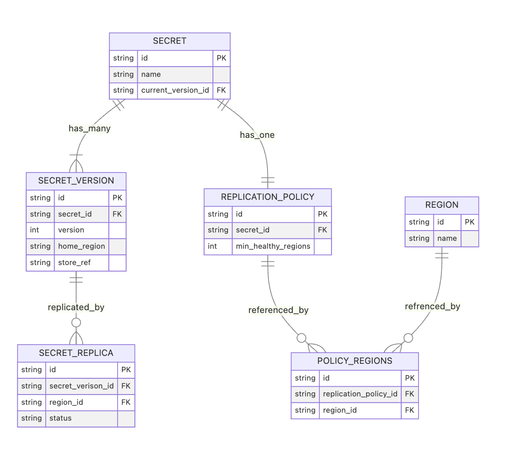
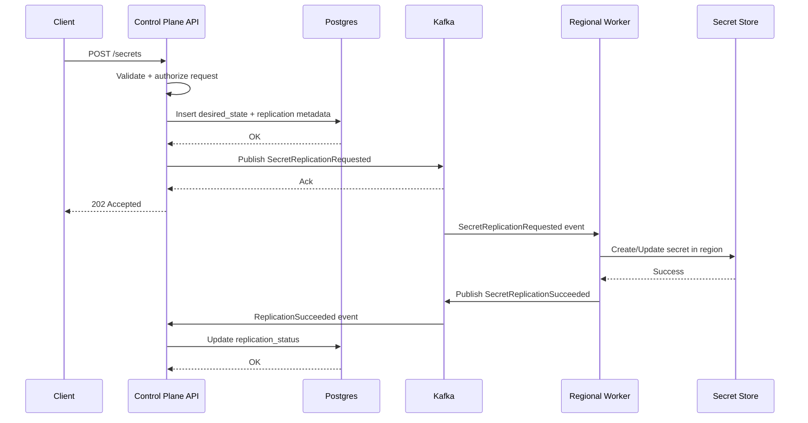

# Multi-Region Secret Replication Control Plane

Architecture Document

## 1. Purpose and Scope

This document describes the architecture for the **multi-region secret
replication control plane**.

The goal of this system is to coordinate the replication of secrets
across multiple regions while providing centralized orchestration,
visibility, and policy enforcement.

This document focuses on the **initial implementation**, which
includes:

- core system components
- persistence model
- the basic secret write flow
- event-driven replication architecture

More advanced behaviors such as reconciliation loops, rotation
workflows, and advanced recovery mechanisms are intentionally out of
scope for this version.

------------------------------------------------------------------------

## 2. System Overview

The system implements an **event-driven control plane** responsible for
orchestrating secret replication across multiple regions.

Clients interact with a **central API** that records the desired
replication state for a secret. The control plane persists metadata in
Postgres and publishes replication events to Kafka.

Regional workers consume these events and perform the necessary
operations in their local region to materialize the secret.

This architecture separates:

- **control plane orchestration**
- **regional execution**

allowing replication work to proceed asynchronously and resiliently
across regions.

At a high level:

1. Client submits a secret write request.
2. Control plane API validates the request and persists desired state.
3. API publishes a replication event.
4. Regional workers consume the event.
5. Workers replicate the secret into their regional secret stores.
6. Replication progress is tracked centrally.

The system is **eventually consistent across regions**.

### System Context Diagram

![[context-diagram-control-plane.png]]

------------------------------------------------------------------------

## 3. Architectural Goals

The architecture is designed to satisfy several key goals.

### Centralized orchestration

Provide a single control plane responsible for managing replication
policy and tracking the lifecycle of secret replication.

### Asynchronous and fault-tolerant processing

Decouple client-facing APIs from region-level execution to allow
replication to continue even when downstream systems are temporarily
unavailable.

### Observability and auditability

Provide visibility into replication state, progress, and failures across
regions.

### Clear separation of responsibilities

Separate orchestration responsibilities from region-specific execution
to simplify system reasoning and failure isolation.

------------------------------------------------------------------------

## 4. Non-Goals (Current Version)

The following capabilities are intentionally **out of scope** for this
version of the system:

- secret deletion workflows
- secret rotation workflows
- reconciliation loops
- automated recovery from replication drift
- cross-cloud secret replication
- operator UI
- advanced retry/backoff policies
- region failover strategies

These capabilities may be introduced in future iterations.

------------------------------------------------------------------------

## 5. System Architecture

The system consists of several core components.

### Control Plane API

The control plane API is responsible for:

- accepting client requests
- validating replication policies
- persisting desired state
- publishing replication events

The API represents the **entry point for secret lifecycle operations**.

It is responsible for orchestrating replication but **does not perform
replication itself**.

------------------------------------------------------------------------

### Postgres (System of Record)

Postgres stores the **authoritative metadata** for secrets and
replication state.

It is the system of record for:

- secret metadata
- secret versions
- replication policies
- regional replication state

Secret values themselves are **not stored directly in the control plane
database**.

Instead, the database stores references to the secret material in the
underlying secret storage system.

------------------------------------------------------------------------

### Kafka (Event Transport)

Kafka provides durable, asynchronous communication between the control
plane and regional workers.

Responsibilities include:

- transporting replication events
- buffering work during regional outages
- enabling asynchronous processing

Kafka allows the system to decouple the **client write path** from
**regional execution work**.

------------------------------------------------------------------------

### Regional Workers

Regional workers are deployed within each target region.

They are responsible for:

- consuming replication events
- writing secrets to the regional secret store
- updating replication state

Workers must be **idempotent** to tolerate duplicate event delivery.

------------------------------------------------------------------------

### Secret Store

Each region maintains its own **secret storage backend** (e.g.,
cloud-native secret manager).

The secret store is responsible for:

- securely storing secret material
- encrypting secrets at rest
- providing access to regional workloads

The control plane manages metadata but **does not replace the underlying
secret storage system**.

------------------------------------------------------------------------

## 6. Data Model

The control plane persists metadata describing secrets, versions, and
replication policy.

### Secret

Represents the logical identity of a secret.

Fields include:

- `id`
- `name`
- `current_version_id`

A secret may have multiple versions over time.

------------------------------------------------------------------------

### SecretVersion

Represents an immutable version of a secret.

Fields include:

- `id`
- `secret_id`
- `version`
- `home_region`
- `store_ref`

`store_ref` references the location of the secret material in the
underlying secret store.

------------------------------------------------------------------------

### ReplicationPolicy

Defines the desired replication behavior for a secret.

Fields include:

- `id`
- `secret_id`
- `min_healthy_regions`

This policy determines how many regions must successfully replicate the
secret before it is considered healthy.

------------------------------------------------------------------------

### PolicyRegion

Defines which regions participate in replication.

Fields include:

- `id`
- `replication_policy_id`
- `region_id`

------------------------------------------------------------------------

### Region

Represents a supported region within the system.

Fields include:

- `id`

------------------------------------------------------------------------

## 7. Write Flow

The basic write flow is responsible for creating a new secret version
and initiating replication. This diagram illustrates the lifecycle of a secret write request:

### Step-by-step flow

1. **Client submits secret write request**

    The client sends a request to the control plane API to create or
    update a secret.

2. **API validates request**

    The control plane validates:

    - authorization
    - replication policy
    - region configuration

3. **Secret version is created**

    The control plane creates a new `SecretVersion` record in Postgres.

4. **Home region secret material is written**

    The secret value is written to the secret store in the home region.

5. **Metadata is persisted**

    The control plane persists metadata describing the new secret
    version and desired replication state.

6. **Replication event is published**

    A `ReplicationRequested` event is published to Kafka.

7. **Regional workers consume event**

    Workers deployed in each region consume the replication event.

8. **Workers replicate secret**

    Workers write the secret into their local regional secret store.

9. **Replication state is updated**

    Workers update the control plane with success or failure results.

------------------------------------------------------------------------

## 8. Event Contract

Replication events contain the information required for regional workers
to materialize secrets.

A replication event includes:

- `secret_id`
- `secret_version_id`
- `home_region`
- `target_regions`
- `replication_policy_id`
- `request_id`
- `timestamp`

Delivery guarantees follow **at-least-once semantics**.

Regional workers must therefore implement **idempotent replication
operations**.

------------------------------------------------------------------------

## 9. Replication State Model

Each region maintains replication state for a given secret version.

Typical lifecycle states include:

- `pending`
- `in_progress`
- `succeeded`
- `failed`

Transitions occur as workers attempt replication.

The control plane aggregates these states to determine whether
replication policy requirements are satisfied.

------------------------------------------------------------------------

## 10. Consistency and Reliability Model

The system provides the following guarantees.

### Durable desired state

Replication intent is persisted in Postgres before events are published.

### Asynchronous regional execution

Replication work is performed asynchronously by regional workers.

### Eventual consistency

Secrets may not be immediately available in all regions after a write
request completes.

### Policy-based readiness

A secret version may be considered healthy once replication policy
requirements are satisfied.

------------------------------------------------------------------------

## 11. Error Handling (Initial Implementation)

Several failure scenarios may occur during the write flow.

### Database write failure

If persistence fails, the API request fails and no replication event is
published.

### Event publication failure

If event publication fails, the request may fail even if metadata was
written.

Future versions may introduce transactional outbox patterns to improve
reliability.

### Worker failure

If regional replication fails:

- replication state is marked failed
- the system may retry replication in the future

### Duplicate events

Kafka may deliver events multiple times.

Workers must therefore ensure replication operations are idempotent.

------------------------------------------------------------------------

## 12. Security Considerations

The system follows several security principles:

- secret material is not stored in plaintext in Postgres
- secrets are stored in regional secret stores
- all control plane operations require authentication and
    authorization
- secret access and replication actions should be auditable
- encryption at rest is handled by the underlying secret store

------------------------------------------------------------------------

## 13. Observability

Observability is critical for operating the replication system.

The architecture supports:

- request tracing from API to worker execution
- replication success/failure metrics
- replication lag monitoring
- audit logs for secret operations

Future versions may introduce dedicated dashboards and operator tooling.

------------------------------------------------------------------------

## 14. Future Work

Future iterations of the system may include:

- reconciliation loops to repair replication drift
- secret rotation workflows
- deletion workflows
- advanced retry and dead-letter handling
- replication health dashboards
- policy-driven readiness guarantees
- multi-cloud replication support

## 15. Related Documents

- [Design Issue](https://github.com/max-allen/multi-region-secrets-control-plane/issues/1)
- [ER Diagram](./erd.png)
- [System Context Diagram](./context-diagram-control-plane.png)
